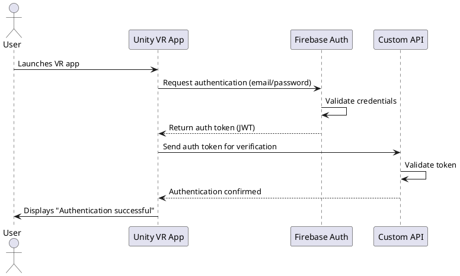
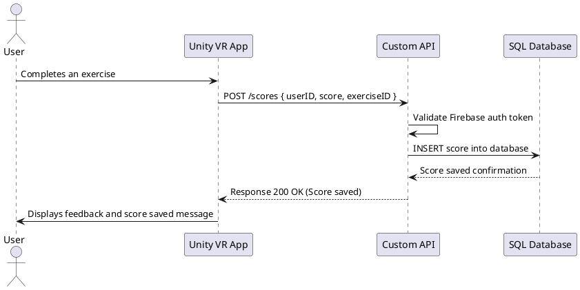
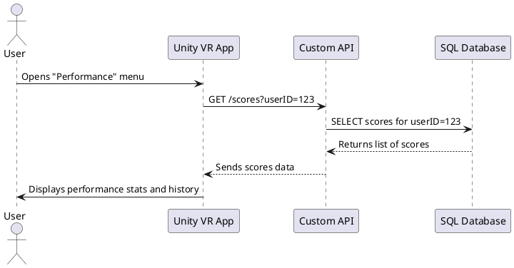

# BrainBoostVR – Technical Documentation

## 1️⃣ User Stories

| User Story | Priority (MoSCoW) | Notes |
|------------|-----------------|-------|
| As a user, I want to navigate the VR environment using controllers, so that I can move freely and interact with objects. | Must Have | Core interaction for all exercises. |
| As a user, I want to interact with objects in the exercise, so that I can complete cognitive tasks. | Must Have | Includes grabbing, moving, or selecting objects. |
| As a user, I want immediate visual and audio feedback during exercises, so that I understand if I am performing actions correctly. | Must Have | Essential for engagement and learning. |
| As a user, I want to see my performance score at the end of each exercise, so that I can track my progress. | Must Have | Requires integration with Firebase for score storage. |
| As a user, I want to access a tutorial before starting exercises, so that I know how to use the VR controllers and interact with objects. | Must Have | Tutorial guides basic movement, object interaction, and camera rotation. |
| As a user, I want to be able to pause or exit exercises at any time, so that I can control my session comfortably. | Should Have | Optional but improves accessibility. |
| As a user, I want to have multiple difficulty levels for exercises, so that I can progressively challenge myself. | Could Have | Planned for future updates. |

---

## 2️⃣ Mockups / Interface Overview

The MVP does not yet include fully developed UI screens, but the following sketches represent the **main interface and user flow in VR**:

1. **Main Menu / Hub**  
   - Options: Start Exercise, Tutorial, Quit  
   - Display brief instructions for controller usage  
   

2. **Exercise Scene**  
   - Interactive objects in the VR environment  
   - Immediate visual and audio feedback for user actions  
   - Floating UI showing current score or progress (optional)  
   

3. **Tutorial Scene**  
   - Demonstrates VR interactions (grabbing objects, teleportation, camera rotation)  
   - Step-by-step instructions or highlights on controllers  
   

4. **End of Exercise**  
   - Summary of performance (score, correct/incorrect actions)  
   - Options: Restart, Main Menu, Exit  
   

---

## 3️⃣ System Architecture Overview

### 3.1 Components Overview

The MVP system consists of three main layers:

- **VR Front-End (Unity + C#)**  
  - Handles VR interactions, exercises, tutorials, and local scoring.  

- **Custom REST API**  
  - Manages communication between Unity and SQL database.  
  - Handles reading/writing scores, sessions, and metadata.  
  - Verifies Firebase authentication tokens before granting access.  

- **SQL Database**  
  - Stores users, scores, exercises, and session data in normalized tables.  
  - Serves as the **main storage** for all application data.  

- **Firebase Authentication (External Service)**  
  - Used **only for authentication** (login/logout).  
  - Provides secure token-based authentication, but does **not** store session or score data.

## 4️⃣ Key Classes (Unity + API)

### 4.1 Unity (C#) Classes

| Class Name       | Description                                | Key Attributes                            | Key Methods                                |
|------------------|-------------------------------------------|------------------------------------------|--------------------------------------------|
| `PlayerController` | Manages player movement & interactions.  | `playerID`, `position`, `controllerInput` | `MovePlayer()`, `GrabObject()`, `Teleport()` |
| `ExerciseManager`  | Handles exercises & cognitive tasks.    | `exerciseID`, `difficulty`, `currentScore` | `StartExercise()`, `ValidateAnswer()`, `EndExercise()` |
| `ScoreManager`     | Manages scoring & feedback system.      | `currentScore`, `maxScore`              | `UpdateScore()`, `ShowFeedback()`, `ResetScore()` |
| `UIManager`        | Controls VR menu navigation & HUD.      | `menuPanels`, `tutorialUI`              | `ShowMainMenu()`, `ShowScorePanel()`, `ToggleTutorial()` |
| `ApiClient`        | Handles requests to the custom API.    | `baseUrl`, `authToken`                  | `PostScore()`, `GetScores()`, `HandleError()` |

---

### 4.2 Custom API (Backend) Classes

| Class Name     | Description                              | Key Attributes            | Key Methods              |
|---------------|-----------------------------------------|--------------------------|-------------------------|
| `User`        | Represents a registered VR user.        | `userID`, `email`        | `CreateUser()`, `GetUser()` |
| `Score`       | Stores exercise results.                | `userID`, `exerciseID`, `score`, `timestamp` | `SaveScore()`, `GetScores()` |
| `Session`     | Tracks user sessions.                    | `sessionID`, `startTime`, `endTime` | `StartSession()`, `EndSession()` |

---

## 5️⃣ Database Design (SQL)

### 5.1 Tables & Schema

| Table Name | Columns | Notes |
|------------|--------|-------|
| `users`   | `userID` (PK), `email`, `createdAt` | Stores user accounts and registration date |
| `scores`  | `scoreID` (PK), `userID` (FK), `exerciseID`, `score`, `timestamp` | Stores results of exercises |
| `sessions`| `sessionID` (PK), `userID` (FK), `startTime`, `endTime`, `duration` | Stores session start/end times and duration |

### 5.2 Relationships

- One `User` → Many `Scores` (1:N)  
- One `User` → Many `Sessions` (1:N)  
- `Scores` and `Sessions` reference `users.userID` as a foreign key  

---

## 6️⃣ VR UI Components

| UI Component    | Description                     | Interactions                         |
|-----------------|---------------------------------|-------------------------------------|
| **Main Menu**   | Central hub for navigation.     | Start exercise, view tutorial, quit. |
| **Tutorial UI** | Guides users through VR basics. | Highlights controllers and actions.  |
| **Score Panel** | Displays real-time scoring.     | Updates dynamically after actions.   |
| **End-Screen**  | Shows summary of performance.   | Retry, go to menu, or exit.          |

# 7️⃣ Sequence Diagrams

### Use Case 1 – User Authentication (Login)

### Use Case 2 - Save User Score

### Use Case 3 - View Performance History

8️⃣ API Specifications
8.1 External APIs
| API                         | Purpose                                         | Notes                                                              |
| --------------------------- | ----------------------------------------------- | ------------------------------------------------------------------ |
| **Firebase Authentication** | Handle user accounts and login/logout securely  | Chosen for easy integration with Unity and secure token-based auth |
| **Firebase Firestore**      | Store and retrieve user scores and session data | Real-time database, scalable, works well with VR app               |

8.2 Internal (Custom) API
The Custom API handles communication between Unity and the SQL database, with optional syncing to Firebase.

API Endpoints Overview
| Endpoint    | Method | Input                                                       | Output                                                                            | Description                                                      |
| ----------- | ------ | ----------------------------------------------------------- | --------------------------------------------------------------------------------- | ---------------------------------------------------------------- |
| `/login`    | POST   | `{ "email": "...", "password": "..." }`                     | `{ "authToken": "...", "userID": "..." }`                                         | Authenticate user and start session                              |
| `/scores`   | POST   | `{ "userID": "...", "exerciseID": "...", "score": 85 }`     | `{ "status": "success" }`                                                         | Save exercise score to SQL database; optionally sync to Firebase |
| `/scores`   | GET    | `{ "userID": "..." }`                                       | `{ "scores": [ { "exerciseID": "...", "score": 85, "timestamp": "..." }, ... ] }` | Retrieve all scores for a specific user                          |
| `/sessions` | POST   | `{ "userID": "...", "startTime": "...", "endTime": "..." }` | `{ "status": "success" }`                                                         | Log user session duration                                        |
| `/users`    | GET    | `{ "userID": "..." }`                                       | `{ "userID": "...", "email": "...", "createdAt": "..." }`                         | Retrieve user profile information                                |

# 9️⃣ Plan SCM and QA Strategies

## 9.1 SCM (Source Code Management) Strategy

- **Version Control Tool**: Git (via GitHub or GitLab repository)  
- **Branching Strategy**:  
  - `main` branch: Always contains stable and tested code  
  - `feature/*` branches: Created for individual tasks or features; merged into `main` after testing  
- **Commit Practices**:  
  - Regular commits with clear messages describing changes  
  - Follow conventional commit standards (e.g., `feat:`, `fix:`, `docs:`)  
- **Code Review**:  
  - Self-review commits before merging to `main` (solo project)

---

## 9.2 QA (Quality Assurance) Strategy

- **Testing Strategy**:  
  - Unit tests for key C# classes (e.g., `ExerciseManager`, `ScoreManager`)  
  - Integration tests for API interactions between Unity and Custom API / Firebase  
  - Manual testing for VR user flows to validate interactions, tutorial experience, and scoring display
- **Testing Tools**:  
  - Unity Test Framework for automated unit tests  
  - Postman for API endpoint testing  
  - Manual test cases documented in a spreadsheet or Notion board
- **Deployment Pipeline**:  
  - Staging builds deployed to Oculus Quest 2 for internal QA  
  - Production build for demo day or MVP release after QA approval
- **Continuous Feedback**:  
  - Log issues and bugs in GitHub Issues or a task management tool  
  - Regular testing after new features are integrated to prevent regressions

---

# Technical Justifications

- **Unity + C#**: Best suited for VR development; supports Oculus Quest 2 and XR Interaction Toolkit  
- **Firebase**: Provides secure authentication and scalable real-time storage for scores  
- **Custom API**: Ensures separation between VR front-end and backend; allows SQL storage with optional Firebase sync  
- **SQL Database**: Structured storage of users, scores, and sessions; ensures data integrity and easy querying  
- **Wireframes (Figma)**: Useful to visualize VR UI layout without building full scenes, improving planning and communication  
- **SCM & QA**: Git ensures version control and historical tracking; unit/integration/manual tests maintain quality and smooth user experience
