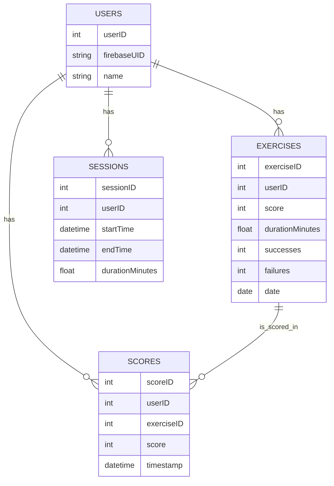
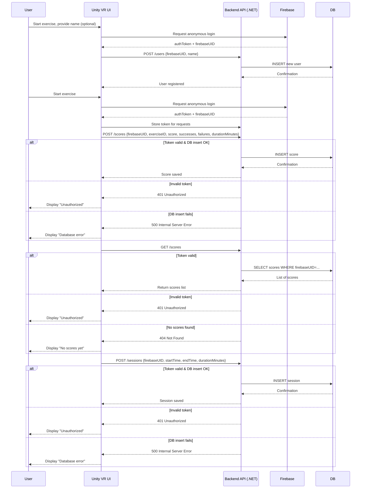

# BrainBoostVR – Technical Documentation

# Table of Contents

1. [User Stories](#1️⃣-user-stories)
2. [Mockups / Interface Overview](#2️⃣-mockups--interface-overview)
3. [System Architecture Overview](#3️⃣-system-architecture-overview)
   * [Components Overview](#31-components-overview)
   * [Architecture Diagram](#32-architecture-diagram)
4. [Key Classes (Unity + API)](#4️⃣-key-classes-unity--api)
   * [Unity (C#) Classes](#41-unity-c-classes)
   * [Custom API (Backend) Classes](#42-custom-api-backend-classes)
5. [Database Design (SQL)](#5️⃣-database-design-sql)
   * [Tables & Schema](#51-tables--schema)
   * [Relationships](#52-relationships)
   * [Entity-Relationship Diagram (ERD)](#53-entity-relationship-diagram-erd)
6. [VR UI Components](#6️⃣-vr-ui-components)
7. [Sequence Diagrams](#7️⃣-sequence-diagrams)
8. [API Specifications](#8️⃣-api-specifications)
   * [External Service: Firebase Anonymous Authentication](#81-external-service-firebase-anonymous-authentication)
   * [Custom REST API (SQL Storage)](#82-custom-rest-api-sql-storage)
9. [Plan SCM and QA Strategies](#9️⃣-plan-scm-and-qa-strategies)
10. [Technical Justifications](#technical-justifications)

---

## 1️⃣ User Stories

| User Story                                                                                                                                | Priority (MoSCoW) | Notes                                                                    |
| ----------------------------------------------------------------------------------------------------------------------------------------- | ----------------- | ------------------------------------------------------------------------ |
| As a user, I want to navigate the VR environment using controllers, so that I can move freely and interact with objects.                  | Must Have         | Core interaction for all exercises.                                      |
| As a user, I want to interact with objects in the exercise, so that I can complete cognitive tasks.                                       | Must Have         | Includes grabbing, moving, or selecting objects.                         |
| As a user, I want immediate visual and audio feedback during exercises, so that I understand if I am performing actions correctly.        | Must Have         | Essential for engagement and learning.                                   |
| As a user, I want to see my performance score at the end of each exercise, so that I can track my progress.                               | Must Have         | Requires integration with SQL backend.                                   |
| As a user, I want to access a tutorial before starting exercises, so that I know how to use the VR controllers and interact with objects. | Must Have         | Tutorial guides basic movement, object interaction, and camera rotation. |
| As a user, I want to be able to pause or exit exercises at any time, so that I can control my session comfortably.                        | Should Have       | Optional but improves accessibility.                                     |
| As a user, I want to have multiple difficulty levels for exercises, so that I can progressively challenge myself.                         | Could Have        | Planned for future updates.                                              |

---

## 2️⃣ Mockups / Interface Overview

| Menu                                                                                                                 | Exercise                                                                                                             | Tutorial                                                                                                                 | End Screen                                                                                                                   |
| -------------------------------------------------------------------------------------------------------------------- | -------------------------------------------------------------------------------------------------------------------- | ------------------------------------------------------------------------------------------------------------------------ | ---------------------------------------------------------------------------------------------------------------------------- |
|  <br/>Main navigation hub. |  <br/>Exercise view with timer and interactive objects. |  <br/>Guides the user on controls and interactions. |  <br/>Summary of performance and feedback. |

---

## 3️⃣ System Architecture Overview

### 3.1 Components Overview

* **VR Front-End (Unity + C#)**  
  Handles VR interactions, tutorials, scoring UI, and communication with the backend API.

* **Custom REST API (.NET)**  
  Validates Firebase anonymous authentication tokens and manages reading/writing scores and sessions into SQL.

* **SQL Database (PostgreSQL / MySQL)**  
  Stores users, scores, exercises, and sessions in normalized tables.

* **Firebase Anonymous Authentication**  
  Provides secure anonymous login for each user session via unique Firebase UID.

### 3.2 Architecture Diagram

```mermaid
graph TD
  A["Oculus Quest 2"] --> B["Unity VR App"]
  B --> C["Custom REST API - .NET"]
  C --> D["Firebase Auth (Anonymous)"]
  C --> DB["SQL Database"]
  DB --> U["Users"]
  DB --> X["Exercises"]
  DB --> S["Scores"]
  DB --> SE["Sessions"]

````
---

## 4️⃣ Key Classes (Unity + API)

This section details the core classes used in Unity and the Custom API, including attributes and methods that support VR interactions, exercises, and data management.

### 4.1 Unity (C#) Classes

| Class Name         | Description                         | Key Attributes             | Key Methods                                                      |
| ------------------ | ----------------------------------- | -------------------------- | ---------------------------------------------------------------- |
| `PlayerController` | Handles VR movement & interactions. | `playerID`, `position`     | `MovePlayer()`, `GrabObject()`, `Teleport()`, `LogInteraction()` |
| `ExerciseManager`  | Manages cognitive exercises.        | `exerciseID`, `difficulty` | `StartExercise()`, `ValidateAnswer()`, `EndExercise()`           |
| `ScoreManager`     | Manages scoring & feedback.         | `currentScore`, `maxScore` | `UpdateScore()`, `ShowFeedback()`, `ResetScore()`                |
| `UIManager`        | Handles VR menus & HUD.             | `menuPanels`, `tutorialUI` | `ShowMainMenu()`, `ShowScorePanel()`, `ToggleTutorial()`         |
| `ApiClient`        | Communicates with REST API.         | `baseUrl`, `authToken`     | `PostScore()`, `GetScores()`, `HandleError()`                    |

---

### 4.2 Custom API (Backend) Classes

Classes managing users, scores, and sessions on the backend, ensuring data persistence and security.

| Class Name | Description                   | Key Attributes                                                              | Key Methods                      |
| ---------- | ----------------------------- | --------------------------------------------------------------------------- | -------------------------------- |
| `User`     | Represents an anonymous user. | `firebaseUID`, `name`                                                       | `GetUser()`, `SyncUser()`        |
| `Score`    | Stores exercise results.      | `scoreID`, `userID`                                                         | `SaveScore()`, `GetScores()`     |
| `Session`  | Tracks VR sessions.           | `sessionID`, `userID`                                                       | `StartSession()`, `EndSession()` |
| `Exercise` | Stores exercise performance.  | `exerciseID`, `userID`, `score`, `durationMinutes`, `successes`, `failures` | `RecordExercise()`               |

---

## 5️⃣ Database Design (SQL)

This section defines the database structure for BrainBoostVR, including tables, columns, relationships, and an ER diagram for visualization.

### 5.1 Tables & Schema
```sql
-- Users table
CREATE TABLE Users (
    userID INT PRIMARY KEY AUTO_INCREMENT,
    firebaseUID VARCHAR(255) UNIQUE NOT NULL,
    name VARCHAR(100) NOT NULL
);

-- Exercises table
CREATE TABLE Exercises (
    exerciseID INT PRIMARY KEY AUTO_INCREMENT,
    userID INT NOT NULL,
    score INT,
    durationMinutes FLOAT,
    successes INT,
    failures INT,
    date DATE,
    FOREIGN KEY (userID) REFERENCES Users(userID)
);

-- Scores table
CREATE TABLE Scores (
    scoreID INT PRIMARY KEY AUTO_INCREMENT,
    userID INT NOT NULL,
    exerciseID INT NOT NULL,
    score INT,
    timestamp DATETIME DEFAULT CURRENT_TIMESTAMP,
    FOREIGN KEY (userID) REFERENCES Users(userID),
    FOREIGN KEY (exerciseID) REFERENCES Exercises(exerciseID)
);

-- Sessions table
CREATE TABLE Sessions (
    sessionID INT PRIMARY KEY AUTO_INCREMENT,
    userID INT NOT NULL,
    startTime DATETIME,
    endTime DATETIME,
    durationMinutes FLOAT,
    FOREIGN KEY (userID) REFERENCES Users(userID)
);

```

### 5.2 Relationships

- Each `User` can have multiple `Exercises`, `Scores`, and `Sessions`.

- Exercises are linked to `Users` via `userID` (FK).

- `Scores` are linked to `Exercises` and `Users`.

- Sessions are linked to Users.

### 5.3 Entity-Relationships Diagram (ERD)

---

## 6️⃣ VR UI Components

| UI Component    | Description                     | Interactions                         |
|-----------------|---------------------------------|-------------------------------------|
| **Main Menu**   | Central hub for navigation.     | Start exercise, view tutorial, quit. |
| **Tutorial UI** | Guides users through VR basics. | Highlights controllers and actions.  |
| **Score Panel** | Displays real-time scoring.     | Updates dynamically after actions.   |
| **End-Screen**  | Shows summary of performance.   | Retry, go to menu, or exit.          |

___

## 7️⃣ Sequence Diagrams


---

# 8️⃣ API Specifications

## 8.1 External Service: Firebase Anonymous Authentication 
- Provides unique `firebaseUID` per session without collecting email/password.

- Token used in `Authorization` header for all API requests.

- Secures user identification without exposing sequential IDs.

## 8.2 Custom REST aPI (.NET)

| Endpoint   | Method | Input Example                                                                                                   | Output Example                                | Description                            |
|-----------|--------|----------------------------------------------------------------------------------------------------------------|-----------------------------------------------|----------------------------------------|
| /users    | POST   | { "firebaseUID": "...", "name": "Paul B." }                                                                    | { "status": "success" }                       | Register new user with Firebase UID    |
| /scores   | POST   | { "firebaseUID": "...", "exerciseID": 1, "score": 5, "successes":5, "failures":0, "durationMinutes":2.5 }      | { "status": "success" }                       | Submit score for exercise              |
| /scores   | GET    | Header: Authorization: Bearer <JWT>                                                                            | { "scores": [ ... ] }                         | Retrieve scores for authenticated user |
| /sessions | POST   | { "firebaseUID": "...", "startTime": "...", "endTime": "...", "durationMinutes": 2.5 }                         | { "status": "success" }                       | Submit session history                 |
| /users    | GET    | Header: Authorization: Bearer <JWT>                                                                            | { "firebaseUID": "...", "name": "Paul B." }  | Retrieve user info                     |


# 9️⃣ Plan SCM and QA Strategies

## 9.1 Source Code Management
- **Tool**: Git (GitHub)  
- **Branching**:  
  - `main` -> stable
  - `development` -> all Unity project changes, scripts, and features
- **Commit**: Conventional commit (`feat:`, `fix:`, `docs:`)
- **Pull Requests**: Not used (solo project)  

## 9.2 QA (Quality Assurance) Strategy
- **Testing Methods**:  
  - **Unit tests**: C# (Unity Test Framework)  
  - **Integration tests:** API endpoints via Postman
  - **VR Manual tests** Oculus Quest 2

- **Focus Areas**:
  - VR interactions (Grab/Release, teleportation)
  - Score and session logging
  - Anonymous authentication via Firebase

- **Deployment Pipeline**:  
  - Staging builds for QA  
  - Production build after approval

---

<h2 id="technical-justifications">🔧 Technical Justifications</h2>

- Unity + C#: Best for VR; modular scripts, XR Toolkit support.

- XR Interaction Toolkit: Handles locomotion, grabbing, teleportation, smoothing.

- Firebase Anonymous Auth: Secure user identification without emails/passwords.

- Custom REST API (.NET): Stores scores, sessions, links firebaseUID to SQL.

- SQL Database: Secure storage, history tracking, normalized schema.

- VR UI & Feedback: Clear tutorials, exercise guidance, real-time scoring.

- SCM & QA: Git version control, testing ensures VR experience quality.