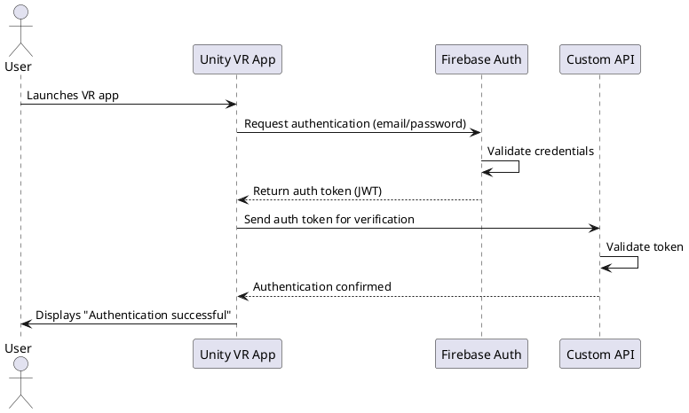
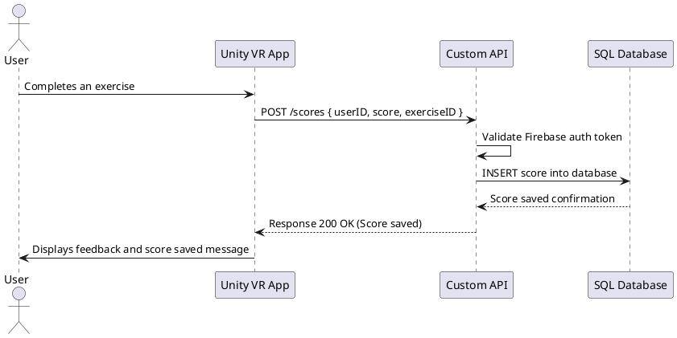
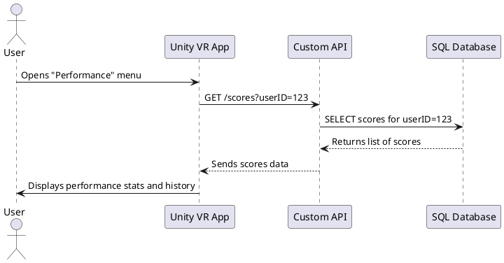

# BrainBoostVR – Technical Documentation

## 1️⃣ User Stories

| User Story | Priority (MoSCoW) | Notes |
|------------|-----------------|-------|
| As a user, I want to navigate the VR environment using controllers, so that I can move freely and interact with objects. | Must Have | Core interaction for all exercises. |
| As a user, I want to interact with objects in the exercise, so that I can complete cognitive tasks. | Must Have | Includes grabbing, moving, or selecting objects. |
| As a user, I want immediate visual and audio feedback during exercises, so that I understand if I am performing actions correctly. | Must Have | Essential for engagement and learning. |
| As a user, I want to see my performance score at the end of each exercise, so that I can track my progress. | Must Have | Requires integration with Firebase for score storage. |
| As a user, I want to access a tutorial before starting exercises, so that I know how to use the VR controllers and interact with objects. | Must Have | Tutorial guides basic movement, object interaction, and camera rotation. |
| As a user, I want to be able to pause or exit exercises at any time, so that I can control my session comfortably. | Should Have | Optional but improves accessibility. |
| As a user, I want to have multiple difficulty levels for exercises, so that I can progressively challenge myself. | Could Have | Planned for future updates. |

---

## 2️⃣ Mockups / Interface Overview

The MVP does not yet include fully developed UI screens, but the following sketches represent the **main interface and user flow in VR**:

| Menu | Exercise | Tutorial | End Screen |
|------|---------|----------|------------|
|  |  |  |  |

---

## 3️⃣ System Architecture Overview

### 3.1 Components Overview

The MVP system consists of three main layers:

- **VR Front-End (Unity + C#)**  
  - Handles VR interactions, tutorials, scoring UI, and communication with API.

- **Custom REST API (Node.js / .NET)**  
  - Validates Firebase authentication tokens. 
  -  Manages reading/writing scores and sessions into SQL.

- **SQL Database (PostgreSQL / MySQL)**  
  - Stores users, scores, exercises, and sessions in normalized tables.  

- **Firebase Authentication**  
  - Handles **secure login & registration**.  
  - Only provides **JWT tokens**, no score storage.

### 3.2 Architecture Diagram
```scss
   [ Oculus Quest 2 ]
          │
          ▼
   [ Unity VR App ]
          │
          ▼
   ┌─────────────┐        ┌───────────────┐
   │ Firebase    │        │  Custom REST  │
   │ Auth        │<──────>│   API Server  │
   └─────────────┘        │ (Express/.NET)│
          │                │              │
          ▼                ▼              │
     [ Auth Token ]   [ SQL Database ]    │
                        (Users, Scores,
                        Sessions, Logs)
```

## 4️⃣ Key Classes (Unity + API)

### 4.1 Unity (C#) Classes

| Class Name         | Description                         | Key Attributes             | Key Methods                                              |
| ------------------ | ----------------------------------- | -------------------------- | -------------------------------------------------------- |
| `PlayerController` | Handles VR movement & interactions. | `playerID`, `position`     | `MovePlayer()`, `GrabObject()`, `Teleport()`             |
| `ExerciseManager`  | Manages cognitive exercises.        | `exerciseID`, `difficulty` | `StartExercise()`, `ValidateAnswer()`, `EndExercise()`   |
| `ScoreManager`     | Manages scoring & feedback.         | `currentScore`, `maxScore` | `UpdateScore()`, `ShowFeedback()`, `ResetScore()`        |
| `UIManager`        | Handles VR menus & HUD.             | `menuPanels`, `tutorialUI` | `ShowMainMenu()`, `ShowScorePanel()`, `ToggleTutorial()` |
| `ApiClient`        | Communicates with REST API.         | `baseUrl`, `authToken`     | `PostScore()`, `GetScores()`, `HandleError()`            |

---

### 4.2 Custom API (Backend) Classes

| Class Name | Description                   | Key Attributes          | Key Methods                      |
| ---------- | ----------------------------- | ----------------------- | -------------------------------- |
| `User`     | Represents a registered user. | `userID`, `email`       | `GetUser()`, `SyncUser()`        |
| `Score`    | Stores exercise results.      | `scoreID`, `userID`     | `SaveScore()`, `GetScores()`     |
| `Session`  | Tracks VR sessions.           | `sessionID`, `duration` | `StartSession()`, `EndSession()` |

---

## 5️⃣ Database Design (SQL)

### 5.1 Tables & Schema

| Table Name | Columns                                                             | Notes                  |
| ---------- | ------------------------------------------------------------------- | ---------------------- |
| `users`    | `userID` (PK), `email`, `createdAt`                                 | Stores user data       |
| `scores`   | `scoreID` (PK), `userID` (FK), `exerciseID`, `score`, `timestamp`   | Stores exercise scores |
| `sessions` | `sessionID` (PK), `userID` (FK), `startTime`, `endTime`, `duration` | Stores VR session info |

### 5.2 Relationships

- One `User` → N Scores
- One `User` → N Sessions

---

## 6️⃣ VR UI Components

| UI Component    | Description                     | Interactions                         |
|-----------------|---------------------------------|-------------------------------------|
| **Main Menu**   | Central hub for navigation.     | Start exercise, view tutorial, quit. |
| **Tutorial UI** | Guides users through VR basics. | Highlights controllers and actions.  |
| **Score Panel** | Displays real-time scoring.     | Updates dynamically after actions.   |
| **End-Screen**  | Shows summary of performance.   | Retry, go to menu, or exit.          |

# 7️⃣ Sequence Diagrams

### Use Case 1 – User Authentication (Login)


### Use Case 2 - Save User Score


### Use Case 3 - View Performance History


# 8️⃣ API Specifications

## 8.1 External Service: Firebase Authentication 

- Handles `secure authentication` only.
- Returns a `JWT token`.
- Token is sent in the `Authorization` header when calling the Custom API.

## 8.2 Custom REST API (SQL Storage)

| Endpoint    | Method | Input Example                                           | Output Example                                        | Description                                |
| ----------- | ------ | ------------------------------------------------------- | ----------------------------------------------------- | ------------------------------------------ |
| `/login`    | POST   | `{ "email": "user@test.com", "password": "1234" }`      | `{ "authToken": "...", "userID": 1 }`                 | Authenticates with Firebase, returns token |
| `/scores`   | POST   | `{ "userID": 1, "exerciseID": 5, "score": 85 }`         | `{ "status": "success" }`                             | Saves exercise score in SQL                |
| `/scores`   | GET    | `/scores?userID=1`                                      | `{ "scores": [ ... ] }`                               | Fetches user's scores                      |
| `/sessions` | POST   | `{ "userID": 1, "startTime": "...", "endTime": "..." }` | `{ "status": "success" }`                             | Saves session info                         |
| `/users`    | GET    | `/users?userID=1`                                       | `{ "userID": 1, "email": "...", "createdAt": "..." }` | Returns user profile                       |

# 9️⃣ Plan SCM and QA Strategies

## 9.1 Source Code Management

- **Tool**: Git (GitHub)  
- **Branching**:  
  - `main` -> stable
  - `feature/*` -> per feature
- **Commit**: Conventional commit (`feat:`, `fix:`, `docs:`)  
---

## 9.2 QA (Quality Assurance) Strategy

- **Testing**:  
  - **Unit tests**: C# (Unity Test Framework)  
  - **Integration tests:** Postman for API
  - **VR Manual tests** on Oculus Quest 2
- **Deployment Pipeline**:  
  - Staging builds for QA  
  - Production build after approval

---

# Technical Justifications

- **Unity + C#**: Best suited for VR development; supports Oculus Quest 2 and XR Interaction Toolkit  
- **Firebase**: Provides secure authentication and scalable real-time storage for scores  
- **Custom API**: Ensures separation between VR front-end and backend; allows SQL storage with optional Firebase sync  
- **SQL Database**: Structured storage of users, scores, and sessions; ensures data integrity and easy querying  
- **Wireframes (Figma)**: Useful to visualize VR UI layout without building full scenes, improving planning and communication  
- **SCM & QA**: Git ensures version control and historical tracking; unit/integration/manual tests maintain quality and smooth user experience
