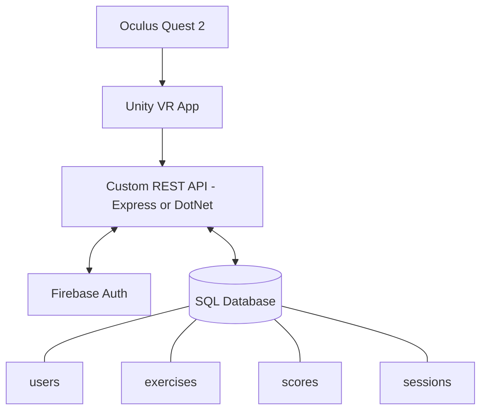
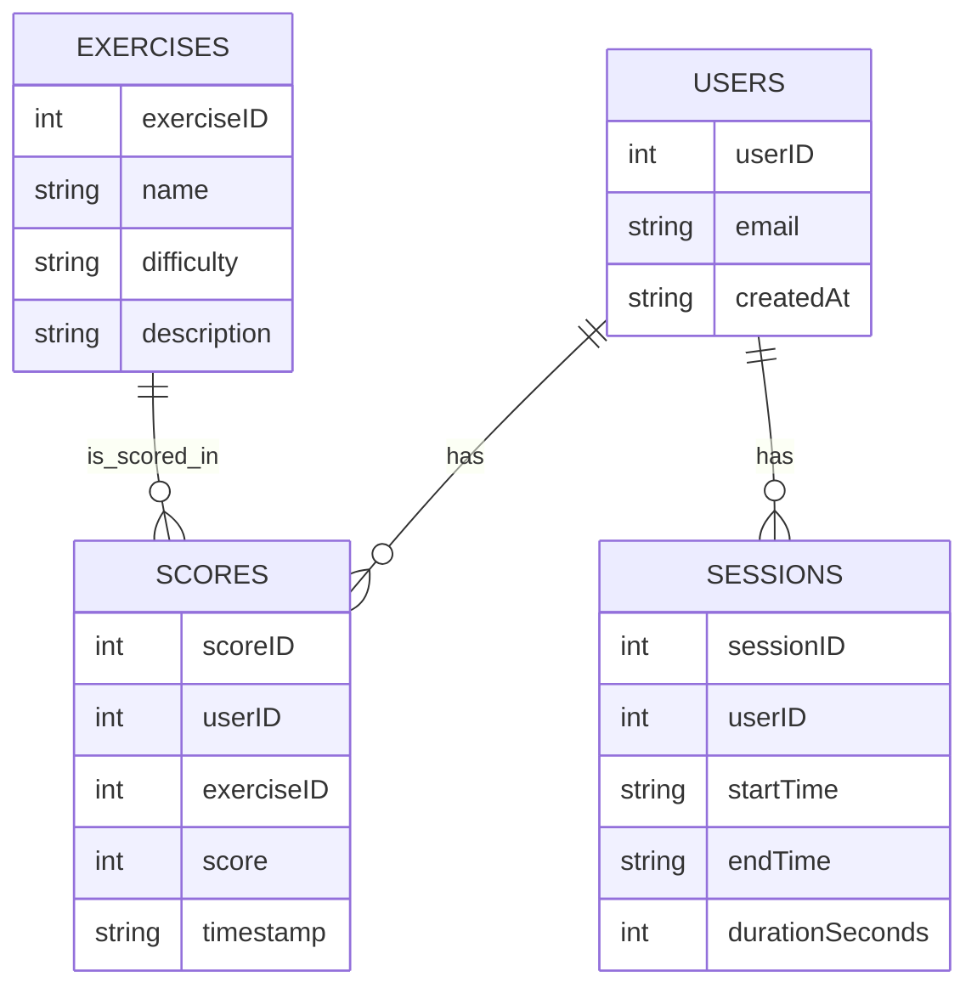
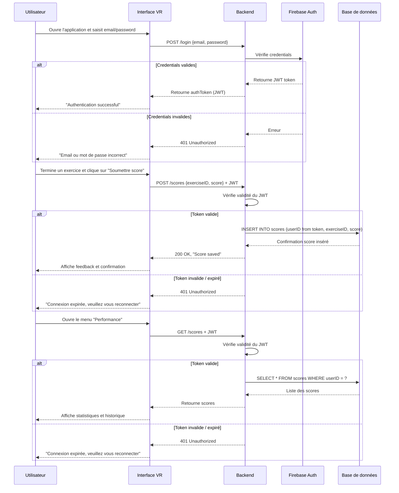

# BrainBoostVR – Technical Documentation

# Table of Contents

1. [User Stories](#1️⃣-user-stories)
2. [Mockups / Interface Overview](#2️⃣-mockups--interface-overview)
3. [System Architecture Overview](#3️⃣-system-architecture-overview)
    - [Components Overview](#31-components-overview)
    - [Architecture Diagram](#32-architecture-diagram)
4. [Key Classes (Unity + API)](#4️⃣-key-classes-unity--api)
    - [Unity (C#) Classes](#41-unity-c-classes)
    - [Custom API (Backend) Classes](#42-custom-api-backend-classes)
5. [Database Design (SQL)](#5️⃣-database-design-sql)
    - [Tables & Schema](#51-tables--schema)
    - [Relationships](#52-relationships)
    - [Entity-Relationship Diagram (ERD)](#53-entity-relationship-diagram-erd)
6. [VR UI Components](#6️⃣-vr-ui-components)
7. [Sequence Diagrams](#7️⃣-sequence-diagrams)
8. [API Specifications](#8️⃣-api-specifications)
    - [External Service: Firebase Authentication](#81-external-service-firebase-authentication)
    - [Custom REST API (SQL Storage)](#82-custom-rest-api-sql-storage)
9. [Plan SCM and QA Strategies](#9️⃣-plan-scm-and-qa-strategies)
    - [Source Code Management](#91-source-code-management)
    - [QA (Quality Assurance) Strategy](#92-qa-quality-assurance-strategy)
10. [Technical Justifications](#technical-justifications)

## 1️⃣ User Stories

This section lists the prioritized user stories for BrainBoostVR, capturing the main actions and goals of users interacting with the VR environment. These stories help define the Minimum Viable Product (MVP) from a user perspective.

| User Story | Priority (MoSCoW) | Notes |
|------------|-----------------|-------|
| As a user, I want to navigate the VR environment using controllers, so that I can move freely and interact with objects. | Must Have | Core interaction for all exercises. |
| As a user, I want to interact with objects in the exercise, so that I can complete cognitive tasks. | Must Have | Includes grabbing, moving, or selecting objects. |
| As a user, I want immediate visual and audio feedback during exercises, so that I understand if I am performing actions correctly. | Must Have | Essential for engagement and learning. |
| As a user, I want to see my performance score at the end of each exercise, so that I can track my progress. | Must Have | Requires integration with Firebase for score storage. |
| As a user, I want to access a tutorial before starting exercises, so that I know how to use the VR controllers and interact with objects. | Must Have | Tutorial guides basic movement, object interaction, and camera rotation. |
| As a user, I want to be able to pause or exit exercises at any time, so that I can control my session comfortably. | Should Have | Optional but improves accessibility. |
| As a user, I want to have multiple difficulty levels for exercises, so that I can progressively challenge myself. | Could Have | Planned for future updates. |

---

## 2️⃣ Mockups / Interface Overview

This section provides visual representations of the main interfaces in BrainBoostVR. The mockups help to understand the user flow and interaction patterns within the VR environment before full implementation.

| Menu | Exercise | Tutorial | End Screen |
|------|---------|----------|------------|
|  |  |  |  |

---

## 3️⃣ System Architecture Overview

This section describes the high-level architecture of BrainBoostVR, detailing the components, data flow, and interactions between front-end, back-end, database, and external services. Understanding the system architecture ensures scalability, maintainability, and clear responsibilities for each component.

### 3.1 Components Overview

- **VR Front-End (Unity + C#)**  
  Handles VR interactions, tutorials, scoring UI, and communication with the backend API.

- **Custom REST API (Node.js / .NET)**  
  Validates Firebase authentication tokens and manages reading/writing scores and sessions into SQL.

- **SQL Database (PostgreSQL / MySQL)**  
  Stores users, scores, exercises, and sessions in normalized tables.

- **Firebase Authentication**  
  Provides secure login & registration via JWT tokens.

### 3.2 Architecture Diagram

The following diagram visualizes the BrainBoostVR system, showing how data flows between components:

## 4️⃣ Key Classes (Unity + API)

This section details the core classes used in Unity and the Custom API, including attributes and methods that support VR interactions, exercises, and data management.

### 4.1 Unity (C#) Classes

| Class Name         | Description                         | Key Attributes             | Key Methods                                              |
| ------------------ | ----------------------------------- | -------------------------- | -------------------------------------------------------- |
| `PlayerController` | Handles VR movement & interactions. | `playerID`, `position`     | `MovePlayer()`, `GrabObject()`, `Teleport()`             |
| `ExerciseManager`  | Manages cognitive exercises.        | `exerciseID`, `difficulty` | `StartExercise()`, `ValidateAnswer()`, `EndExercise()`   |
| `ScoreManager`     | Manages scoring & feedback.         | `currentScore`, `maxScore` | `UpdateScore()`, `ShowFeedback()`, `ResetScore()`        |
| `UIManager`        | Handles VR menus & HUD.             | `menuPanels`, `tutorialUI` | `ShowMainMenu()`, `ShowScorePanel()`, `ToggleTutorial()` |
| `ApiClient`        | Communicates with REST API.         | `baseUrl`, `authToken`     | `PostScore()`, `GetScores()`, `HandleError()`            |

---

### 4.2 Custom API (Backend) Classes

Classes managing users, scores, and sessions on the backend, ensuring data persistence and security.

| Class Name | Description                   | Key Attributes          | Key Methods                      |
| ---------- | ----------------------------- | ----------------------- | -------------------------------- |
| `User`     | Represents a registered user. | `userID`, `email`       | `GetUser()`, `SyncUser()`        |
| `Score`    | Stores exercise results.      | `scoreID`, `userID`     | `SaveScore()`, `GetScores()`     |
| `Session`  | Tracks VR sessions.           | `sessionID`, `duration` | `StartSession()`, `EndSession()` |

---

## 5️⃣ Database Design (SQL)

This section defines the database structure for BrainBoostVR, including tables, columns, relationships, and an ER diagram for visualization.

---

## 6️⃣ VR UI Components

Provides an overview of the VR interface elements, showing how users interact with the system during exercises.

| UI Component    | Description                     | Interactions                         |
|-----------------|---------------------------------|-------------------------------------|
| **Main Menu**   | Central hub for navigation.     | Start exercise, view tutorial, quit. |
| **Tutorial UI** | Guides users through VR basics. | Highlights controllers and actions.  |
| **Score Panel** | Displays real-time scoring.     | Updates dynamically after actions.   |
| **End-Screen**  | Shows summary of performance.   | Retry, go to menu, or exit.          |

# 7️⃣ Sequence Diagrams

Illustrates key interactions and use cases in BrainBoostVR.

# 8️⃣ API Specifications

## 8.1 External Service: Firebase Authentication 

Used for secure user authentication, providing JWT tokens for authorization in API requests.

- Handles secure login & registration.
- Returns JWT token.
- Token is sent in `Authorization` header for the Custom API.

## 8.2 Custom REST API (.NET)

| Endpoint    | Method | Input Example                              | Output Example                                        | Description                                    |
| ----------- | ------ | ------------------------------------------ | ----------------------------------------------------- | ---------------------------------------------- |
| `/signup`   | POST   | `{ "email": "...", "password": "..." }`    | `{ "authToken": "...", "userID": 1 }`                 | Crée un utilisateur et retourne token JWT      |
| `/login`    | POST   | `{ "email": "...", "password": "..." }`    | `{ "authToken": "...", "userID": 1 }`                 | Authentifie l’utilisateur, retourne JWT        |
| `/scores`   | POST   | `{ "exerciseID": 5, "score": 85 }`         | `{ "status": "success" }`                             | Sauvegarde le score (userID depuis token)      |
| `/scores`   | GET    | Header: `Authorization: Bearer <JWT>`      | `{ "scores": [ ... ] }`                               | Récupère les scores de l’utilisateur via token |
| `/sessions` | POST   | `{ "startTime": "...", "endTime": "..." }` | `{ "status": "success" }`                             | Sauvegarde la session (userID depuis token)    |
| `/users`    | GET    | Header: `Authorization: Bearer <JWT>`      | `{ "userID": 1, "email": "...", "createdAt": "..." }` | Retourne les infos utilisateur via token       |

# 9️⃣ Plan SCM and QA Strategies

## 9.1 Source Code Management

Describes the version control tools and branching strategy used in the project:

- **Tool**: Git (GitHub)  
- **Branching**:  
  - `main` -> stable
  - `feature/*` -> per feature
- **Commit**: Conventional commit (`feat:`, `fix:`, `docs:`)  
---

## 9.2 QA (Quality Assurance) Strategy

Outlines testing and validation strategies to ensure a stable, high-quality MVP:

- **Testing**:  
  - **Unit tests**: C# (Unity Test Framework)  
  - **Integration tests:** Postman for API
  - **VR Manual tests** on Oculus Quest 2

- **Deployment Pipeline**:  
  - Staging builds for QA  
  - Production build after approval

---

<h2 id="technical-justifications">Technical Justifications</h2>

Rationale for the technologies and design choices in BrainBoostVR:

- **Unity + C#**: Best suited for VR development; supports Oculus Quest 2 and XR Interaction Toolkit.
- **Firebase**: Provides secure authentication via JWT tokens for user login and registration.
- **Custom API**: Ensures separation between VR front-end and backend; allows SQL storage with optional Firebase sync.
- **SQL Database**: Structured storage of users, scores, and sessions; ensures data integrity and easy querying.
- **Wireframes / Mockups**: Used to visualize the VR UI layout before implementation, improving planning and communication. 
- **SCM & QA**: Git ensures version control and historical tracking; unit/integration/manual tests maintain quality and smooth user experience.
